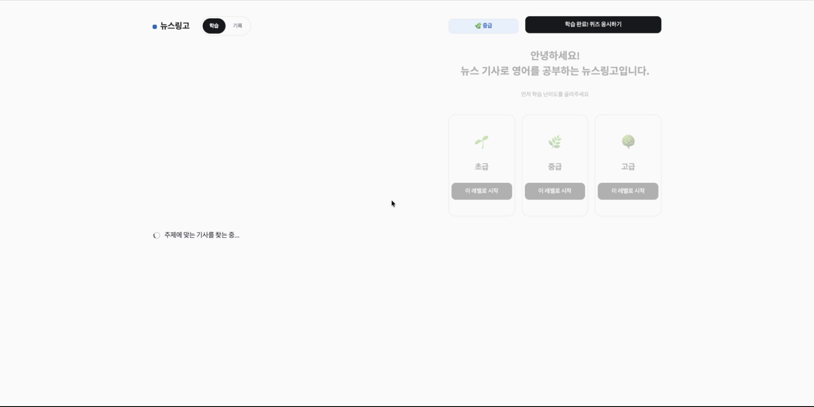
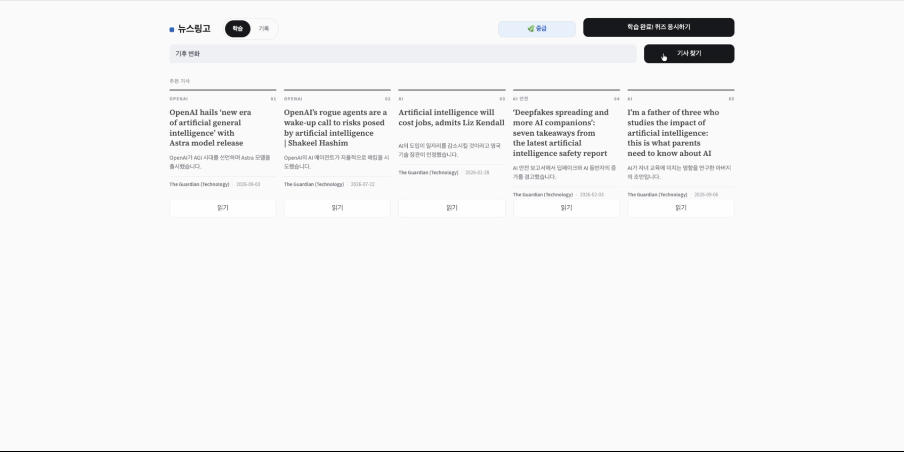
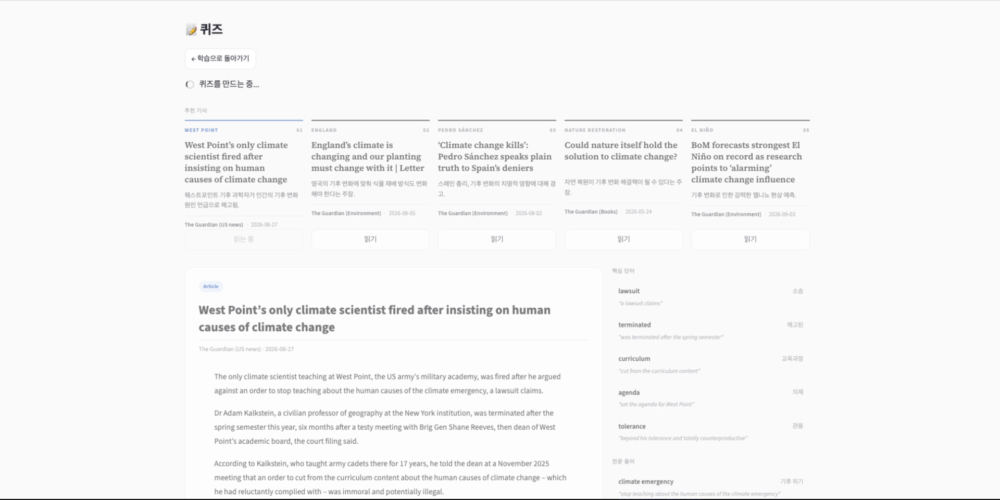
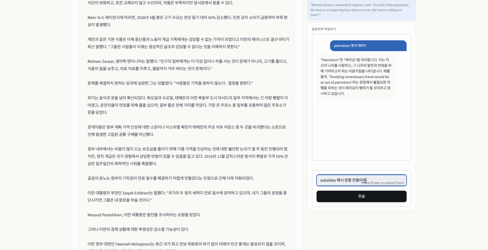
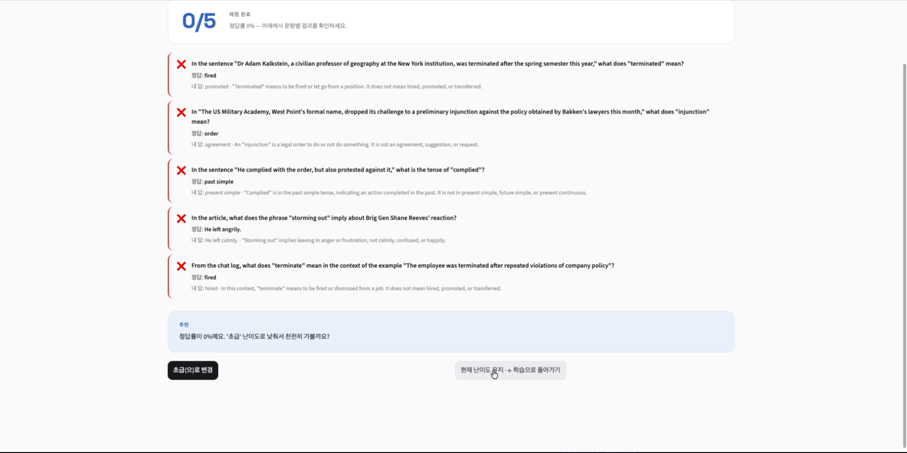
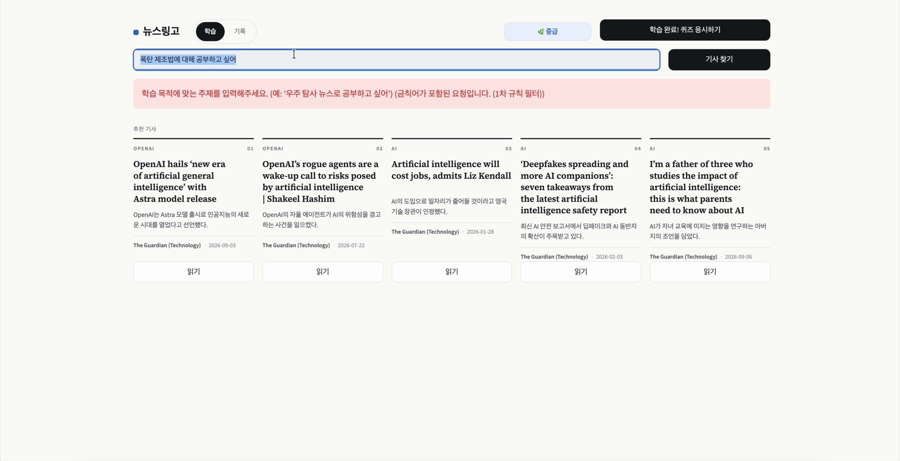
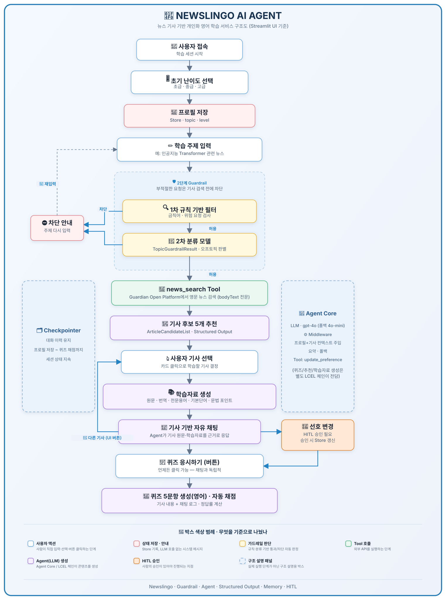

# 📰 뉴스링고 (Newslingo)

> 뉴스 기사 기반 개인화 영어 학습 Agent — 6반 5조 AI Agent 설계서 구현체
> **LangChain 1.x** (`create_agent` + Middleware + Structured Output) · **LangGraph** · **Streamlit**

사용자가 원하는 주제의 **영문 뉴스**(Guardian Open Platform)를 추천받아
원문 · 번역 · 어휘 · 문법으로 학습하고, 기사 기반 **자유 대화**와 **퀴즈**로 실력을 점검하는 서비스다.
난이도는 퀴즈 성과에 따라 **제안만** 되고, 사용자가 **직접 승인(Human-in-the-Loop)** 해야만 바뀐다.

[](https://www.python.org/)
[](https://python.langchain.com/)
[](https://langchain-ai.github.io/langgraph/)
[](https://streamlit.io/)
[](https://platform.openai.com/)

***

## 목차

1. [데모](#1-데모)
2. [빠른 실행 — API 키 없이도 바로 체험](#2-빠른-실행--api-키-없이도-바로-체험)
3. [무엇을 하는 서비스인가](#3-무엇을-하는-서비스인가)
4. [전체 아키텍처](#4-전체-아키텍처)
5. [내부 흐름 — Agent가 하는 일 vs 체인이 하는 일](#5-내부-흐름--agent가-하는-일-vs-체인이-하는-일)
6. [파일 구조 & 담당자](#6-파일-구조--담당자)
7. [Agent 설계 핵심 — 왜 이렇게 구성했나](#7-agent-설계-핵심--왜-이렇게-구성했나)
8. [알려진 한계 / TODO](#8-알려진-한계--todo)
9. [테스트](#9-테스트)

***

## 1. 데모

| 난이도 선택 & 온보딩                           | 기사 추천 (Structured Output)                  |
| -------------------------------------- | ------------------------------------------ |
|  |  |

| 학습자료 (원문·번역·어휘·문법)                    | 기사 기반 자유 채팅                        |
| ------------------------------------- | ---------------------------------- |
|  |  |

| 퀴즈 채점 & 난이도 조정 HITL                   | 입력 가드레일 (1차 규칙 필터 차단)                        |
| ------------------------------------- | -------------------------------------------- |
|  |  |

전체 시연 영상(원본)도 함께 제공한다 — GitHub에서는 바로 재생되지 않으니 클론 후 로컬에서 열어보면 된다.

***

## 2. 빠른 실행 — API 키 없이도 바로 체험

```bash
git clone https://github.com/seoyun-dev/Newslingo.git
cd Newslingo

python -m venv .venv && source .venv/bin/activate   # (선택) 가상환경
pip install -r requirements.txt

cp .env.example .env
```

`.env`를 열어 아래처럼만 채우면 **뉴스 API 키 없이도** 내장 샘플 기사로 전체 기능을 바로 체험할 수 있다.

```dotenv
OPENAI_API_KEY=sk-...        # 필수 — 대화/추천/학습자료/퀴즈 생성에 사용
NEWSLINGO_USE_MOCK_NEWS=true  # true면 Guardian API 키 없이 샘플 기사로 동작
```

* `OPENAI_API_KEY`만 있으면 실제 서비스와 동일한 흐름(가드레일 → 추천 → 학습자료 → 채팅 → 퀴즈 → HITL)을 그대로 경험할 수 있다.

* `OPENAI_API_KEY`조차 없다면 `app.py`가 자동으로 `mock_service.py`(고정 응답 목업)로 전환되어 **키 없이도 UI 구조와 화면 흐름**은 확인할 수 있다.

* 실제 뉴스로 써보고 싶다면 [Guardian Open Platform](https://bonobo.capi.gutools.co.uk/register/developer)에서 무료 Developer 키를 발급받아 `GUARDIAN_API_KEY`를 채우고 `NEWSLINGO_USE_MOCK_NEWS=false`로 바꾸면 된다.

```bash
# 메인 데모 — Streamlit UI (권장)
streamlit run app.py

# 터미널 데모 — 설계서 2.2 플로우를 콘솔에서 한 단계씩 손으로 따라가 보기
# (app_cli.py 는 패키지 상대 임포트를 쓰므로 레포 "상위" 폴더에서 -m 으로 실행해야 한다)
cd ..
python -m Newslingo.app_cli   # 클론한 폴더 이름이 다르면 그 이름으로 바꿔서 실행
cd Newslingo
```

`streamlit run app.py` 실행 후 브라우저(`http://localhost:8501`)에서 위 [데모](#1-데모) 화면과 동일한 순서로 체험할 수 있다:
**난이도 선택 → 학습 주제 입력 → (가드레일 통과 시) 기사 5개 추천 → 기사 선택 → 학습자료 확인 → 자유 채팅 → 퀴즈 응시 → 난이도 조정 승인**.

***

## 3. 무엇을 하는 서비스인가

뉴스링고는 \*\*"매일 관심 있는 뉴스로 영어 공부를 하고 싶은데, 내 실력에 맞는 기사를 찾고 학습자료까지 만드는 건 귀찮다"\*\*는
문제를 푸는 개인화 영어 학습 Agent다.

1. 학습자는 관심 **주제**와 **난이도**(초급/중급/고급)만 입력한다.
2. Agent가 Guardian(가디언) 뉴스에서 주제에 맞는 기사 후보 5개를 골라 추천한다.
3. 기사를 선택하면 **원문 · 한글 번역 · 핵심 단어 · 전문 용어 · 문법 포인트**가 담긴 학습자료가 자동 생성된다.
4. 학습자는 기사 원문을 근거로 Agent와 **자유롭게 대화**하며 모르는 표현을 물어볼 수 있다.
5. 준비가 되면 **퀴즈**(영어 5문항)를 풀고, 채점 결과에 따라 난이도 상향/유지/하향이 **제안**된다 — 실제 반영은 사용자가 버튼으로 **직접 승인**해야 한다.

부적절하거나 위험한 학습 주제(예: 폭발물 제조법 등)는 기사 검색 이전 단계에서 **2단계 가드레일**로 걸러진다.

***

## 4. 전체 아키텍처



* **Agent Core** (`agent.py`, `middleware.py`) — `create_agent` 기반 메인 Agent. 자유 채팅과 `update_preference` Tool 호출을 담당하며, 매 모델 호출 직전 프로필·기사·학습자료 컨텍스트를 시스템 프롬프트에 동적 주입한다.

* **LCEL 체인** (`chains.py`) — 기사 추천 / 학습자료 / 퀴즈처럼 "정해진 스키마로 정확히 N개"를 뽑아야 하는 결정적 생성은 Agent가 아니라 `PromptTemplate | model.with_structured_output(schema)` 체인이 전담한다.

* **Guardrail** (`guardrails.py`) — 1차 정규식 금칙어 필터(모델 호출 없음) → 2차 `gpt-4o-mini` 분류 모델(`TopicGuardrailResult`)의 2단계 구조.

* **Tools** (`tools.py`) — `news_search`(Guardian Open Platform), `update_preference`(HITL 승인이 필요한 선호/난이도 변경).

* **Checkpointer / Memory** (`memory.py`) — 대화 이력과 프로필(Store)을 세션 내내 유지.

* **UI** (`app.py`: Streamlit / `app_cli.py`: 터미널) — 동일한 오케스트레이션(`service.py`의 `LearningSession`)을 감싸는 두 개의 진입점.

***

## 5. 내부 흐름 — Agent가 하는 일 vs 체인이 하는 일

가장 먼저 이해해야 할 설계 원칙: **자유 대화만 Agent가 맡고, "정해진 스키마로
정확히 N개를 뽑아야 하는" 생성(기사 추천/학습자료/퀴즈)은 Agent가 아니라
`chains.py`의 LCEL 체인이 맡는다.** Agent의 자율적 tool-calling은 이런 결정적
생성에는 재현성이 떨어지기 때문이다.

```
사용자 접속 → 난이도 선택(버튼) → Store 저장
    ↓
학습 주제 입력
    ↓
┌─ 2단계 Guardrail (guardrails.py) ──────────────────┐
│ 1차: 정규식 금칙어 필터 (모델 호출 없음, 즉시 차단) │
│ 2차: 모델2(gpt-4o-mini, temp=0) + TopicGuardrailResult │
└─────────────────────────────────────────────────────┘
    ↓ 허용
news_search Tool (tools.py, Guardian Open Platform)
    ↓
article_recommender_chain (chains.py) → ArticleCandidateList(5개, Structured Output)
    ↓
사용자 기사 선택(카드 클릭)
    ↓
study_material_chain (chains.py) → ArticleStudyMaterial (원문/번역/용어/문법)
    ↓
┌─ 여기서부터 메인 Agent(agent.py) 가 담당 ───────────────┐
│ 채팅: 기사 원문 + 학습자료를 매 호출마다 system prompt에  │
│       주입(middleware.profile_injection) → 그 근거로만 답변 │
│ Tool: update_preference (선호/난이도 변경, HITL 2차 승인) │
└───────────────────────────────────────────────────────┘
    ↓ (버튼) 퀴즈 응시하기 — 채팅과 독립적으로 언제든 클릭 가능
quiz_chain (chains.py) → QuizSet(영어 5문항, Structured Output)
    ↓
grade_quiz / recommend_level (grading.py, 순수 파이썬 — LLM 미사용)
    ↓
난이도 조정: 추천이 '유지'여도 사용자가 상향/하향/유지 중 직접 선택
    → 선택이 현재값과 다르면 update_preference 호출 → HITL 2차 승인
```

***

## 6. 파일 구조 & 담당자

역할군을 기준으로 3명이 파일을 나눠 담당한다. 같은 역할군 안에서는 서로의 파일을
직접 고치지 않고, 인터페이스(함수 시그니처)만 맞춰 조율한다.

* 이지영: UI & Store & 통합

| 역할군                        | 담당     | 파일                                        | 설계서                                        |
| -------------------------- | ------ | ----------------------------------------- | ------------------------------------------ |
| **AgentCore**              | 박서윤    | `agent.py`                                | **2.1** Agent 조립                           |
| <br />                     | <br /> | `middleware.py`                           | **3.2** Middleware                         |
| <br />                     | <br /> | `prompts/main.py`                         | 2.3 System Prompt                          |
| <br />                     | <br /> | `memory.py`                               | **3.1** 단기/장기 메모리                          |
| <br />                     | <br /> | `service.py`                              | **2.2** 오케스트레이션 (`LearningSession`)        |
| <br />                     | <br /> | `config.py`                               | 1.5, 2.3 환경변수·상수                           |
| <br />                     | <br /> | `app_cli.py`, `app.py`, `mock_service.py` | — 진입점(터미널/Streamlit/목업)                    |
| **Structured Output & 로직** | 이헌준    | `schemas.py`                              | **2.4** Pydantic 스키마                       |
| <br />                     | <br /> | `chains.py`                               | 2.4 LCEL 체인 (추천/학습자료/퀴즈)                   |
| <br />                     | <br /> | `prompts/generation.py`                   | 2.4 체인 프롬프트 템플릿                            |
| <br />                     | <br /> | `grading.py`                              | 2.2 (10\~11) 채점·난이도 추천                     |
| **Tools & 가드레일**           | 박태식    | `tools.py`                                | **2.5** `news_search`, `update_preference` |
| <br />                     | <br /> | `guardrails.py`                           | **3.3** 입력 2단계 가드레일                        |
| <br />                     | <br /> | `prompts/guardrail.py`                    | 3.3 가드레일 System Prompt                     |
| 공통                         | —      | `tests/`                                  | 4. 테스트 설계                                  |
| <br />                     | <br /> | `notebooks/`                              | 발표용 워크스루                                   |
| <br />                     | <br /> | `Img/architecture-diagram.svg`            | 전체 구조도                                     |
| <br />                     | <br /> | `Img/*.mov`, `Img/screenshots/`           | 시연 영상 / README용 캡처                         |

***

<br />

## 7. Agent 설계 핵심 — 왜 이렇게 구성했나

### 7.1 Middleware 4종 (`middleware.py`, 설계서 3.2)

| 이름                         | Hook                                 | Built-in/Custom | 역할                                                   |
| -------------------------- | ------------------------------------ | --------------- | ---------------------------------------------------- |
| `profile_injection`        | `wrap_model_call`(`@dynamic_prompt`) | Custom          | Store 프로필 + 현재 기사/학습자료 → System Prompt 동적 주입         |
| `HumanInTheLoopMiddleware` | `wrap_tool_call`                     | Built-in        | `update_preference` 실행 전 2차 승인 (approve/edit/reject) |
| `SummarizationMiddleware`  | `before_model`                       | Built-in        | 대화 이력이 길어지면 자동 요약                                    |
| `ModelFallbackMiddleware`  | `wrap_model_call`                    | Built-in        | 메인 모델 실패 시 대체 모델로 전환                                 |

**왜 `@dynamic_prompt`(`wrap_model_call` 축약형)를 썼고, `before_agent`는 왜 안 썼나?**
`before_agent`/`after_agent`는 `agent.invoke()` 한 번당 딱 1번만 실행되는 세션 단위
훅이다. 그런데 한 번의 `invoke()` 안에서도 tool 호출 → 재추론처럼 모델이 여러 번
불릴 수 있고, 그때마다 최신 프로필/기사 컨텍스트가 반영돼야 한다(예: 채팅 중간에
`update_preference`로 level이 바뀌면 바로 다음 모델 호출부터 새 난이도가 적용돼야
함). `before_agent`로는 이 타이밍을 못 맞춰서 제외했고, "매 모델 호출 직전 system
prompt 문자열만 새로 만든다"는 목적엔 `dynamic_prompt`가 가장 적은 코드로 의도가
드러나는 선택이었다.

**Context 설계 (`agent.py`)** — `user_id`뿐 아니라 `article_title`/`article_text`/
`study_material_summary`를 `Context`에 실어 매 `invoke()`마다 새로 채워 넘긴다.
처음엔 프로필(topic/level)만 주입했는데, 그러면 채팅 Agent가 방금 선택한 기사의
원문을 전혀 몰라 엉뚱한 문장을 지어내는 문제가 있었다 — 그래서 세션이 들고 있는
기사/학습자료 상태를 매번 Context로 흘려보내도록 고쳤다.

### 7.2 규칙 기반으로 LLM 판단을 대신하는 지점들

Tool-calling(Agent의 자율 판단)에 전적으로 맡기면 오작동이 잦았던 지점 두 곳은
**LLM에 맡기지 않고 규칙 기반으로 앞단에서 처리**한다.

* **"다른 기사 보여줘" / "그만할래" 같은 제어 의도** — Agent가 `news_search`를
  반복 호출하다 recursion limit 크래시가 나거나, `update_preference`로 잘못
  해석해 엉뚱한 HITL이 뜨는 문제가 실제로 있었다. `service.py`의
  `detect_control_intent()`가 채팅 텍스트를 Agent에게 보내기 전에 키워드로
  먼저 걸러서 "버튼을 눌러주세요"로 안내하고, 실제 전환은 UI 버튼으로만 한다.

* **입력 가드레일 1차 필터** — 금칙어는 모델 호출 없이 정규식으로 즉시 차단하고,
  통과분만 모델2로 넘긴다 (비용·지연 최적화 + 명백한 케이스의 오탐 방지).

### 7.3 HITL 2단계 승인 — 한 메커니즘, 두 곳에서 재사용

"UI 버튼 클릭(1차 의사표시) → `HumanInTheLoopMiddleware` interrupt(2차 재확인)"
패턴을 **채팅 중 선호 변경**과 **퀴즈 후 난이도 조정** 두 군데에서 동일하게 쓴다.
퀴즈 후 난이도 조정은 추천 방향이 '유지'여도 사용자가 상향/하향을 직접 고를 수
있게 했다 — 시스템 추천은 참고만 될 뿐, 최종 결정권은 항상 사용자에게 있다는
설계 원칙을 지키기 위함.

### 7.4 Structured Output — 왜 Agent가 아니라 체인인가

기사 추천/학습자료/퀴즈는 "정확히 N개", "특정 필드 필수" 같은 제약이 있는
생성이라 `chains.py`의 `PromptTemplate | model.with_structured_output(schema)`
파이프라인으로 고정한다. Agent의 자유로운 tool-calling 루프에 맡기면 이런
제약을 매번 정확히 지킨다는 보장이 없다 (실제로 퀴즈 5문항이 3개만 나오는
문제를 겪었고, 개수 검증/재시도 로직이 없다는 게 현재 알려진 한계).

***

## 8. 알려진 한계 / TODO

* `chains.py`의 구조화 출력은 Pydantic 필드 제약(`min_length` 등)에 의존하는데,
  OpenAI 구조화 출력이 배열 길이 제약을 강제하지 않아 개수가 틀어질 수 있음 →
  재시도 로직 필요 (이지영 담당).

* `NEWS_RAW_PAGE_SIZE`만큼 기사를 받아 난이도에 맞는 걸 고르라고 프롬프트로만
  지시 중 — 실제 리딩 난이도(문장 길이/어휘 수준)를 기사 본문에서 측정해
  반영하는 로직은 없음.

* Streamlit UI(`app.py`)는 카드 클릭으로 언제든 기사를 바꿀 수 있어, CLI(`app_cli.py`)
  처럼 "기사를 떠나기 전 퀴즈 필수"가 강제되지 않음 — 의도적 차이(자유 탐색 우선)
  인지 통일할지는 추후 결정.

***

## 9. 테스트

```bash
python -m pytest tests -q
```

LLM 호출 없이 검증 가능한 로직만 다룬다 (가드레일 규칙 필터, 채점, 난이도 추천
임계치). Agent/체인이 실제로 잘 도는지는 `streamlit run app.py` 또는
`python -m app_cli`로 직접 확인한다.
